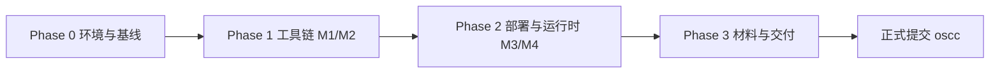

# RQ-VisionKit 项目开发工作流

本 skill 编排「如何一步步完成 RQ-VisionKit 项目」的完整路径，把从环境搭建到最终提交串成一条
可复现、可检查的流水线。只做**总览 + 编排 + 检查点**，具体细节引用各阶段文档，避免重复。

配套的板端部署调试排查流程见 `docs/board-bringup-runbook.md`。

## 何时使用

- 从零复现本项目，或向评委/协作者说明「项目是怎么一步步做出来的」；
- 接手/续做时，快速定位「现在该做哪一步、下一步是什么、验收标准是什么」。

## 项目目标（一句话）

在睿擎 RK3506（3×Cortex-A7，无 NPU）上，把自定义视觉模型以「采集标注 → 模型适配转换 →
低代码部署 → 端侧推理」的全流程不写代码跑通，补齐睿擎平台原生缺失的数据、模型导入与低代码
部署能力。

## 流程总览



四个模块对应四个目录：`annotator/`（M1）、`converter/`（M2）、`deployer/`（M3）、
`runtime/`（M4）。每个 Phase 都有明确的「输入 → 动作 → 输出 → 验收」。

## 分阶段流程

### Phase 0 · 环境与基线（T0.1–T0.4）

| 任务 | 动作 | 输出 / 验收 |
|---|---|---|
| T0.1 环境 | 装 Python 3.10 + NCNN + PyTorch/TensorFlow | 环境可跑 |
| T0.2 冒烟 | 跑 `scripts/smoke_ncnn.py` | NCNN 链路可用（squeezenet 出结果） |
| T0.3 数据 | 跑 `scripts/analyze_neudet.py` / `prepare_neudet_*.py` | NEU-DET 数据理解 + YOLO/分类数据集就绪 |
| T0.4 板端基线 | 烧官方 SMP 固件，串口 `free` 记内存基线 | 系统空载内存基线（见 `docs/baselines.md`） |

### Phase 1 · 工具链 M1 + M2（T1.1–T1.7）

- **M1 采集标注**（`annotator/`）：FastAPI 后端 + Vue3 标注前端，导入/标注/导出 YOLO 数据集。
  验收：`pytest annotator/tests -v`。
- **M2 模型转换**（`converter/`）：ONNX → NCNN（FP32/INT8）一键转换 + 算子兼容扫描。
  验收：`pytest converter/tests -v`；转换记录见 `docs/baselines.md` 的 T1.6/T1.7。
- **训练基线**：论文 MobileNetV2 六分类、YOLOX-Nano 检测（具体精度以 `docs/baselines.md` 实测为准）。

### Phase 2 · 部署与运行时 M3 + M4（T2.1–T2.5）

- **M4 运行时**（`runtime/`）：`pc_sim/` PC 仿真（Python）+ `board/` RK3506 板端（C/C++），
  同一套接口契约（`/health`、`/infer`、`/model/reload`）。验收：`pytest runtime/pc_sim/tests -v`。
- **M3 部署控制台**（`deployer/`）：低代码打包 / 本地 / SSH 下发 / reload / 结果看板。
  验收：`pytest deployer/tests -v`。
- **端到端联调**（T2.4）：六步主流程复现记录见 `docs/e2e-run.md`。
- **扩展 Demo**（T2.5）：机械臂分拣可降级为「分类识别 + 结果显示」，见 `demo/sorting_arm/README.md`。

### Phase 3 · 材料与交付（T3.1–T3.5）

| 任务 | 产出 |
|---|---|
| T3.1 适配报告 | `docs/adaptation-report.md` |
| T3.2 项目介绍 | `docs/project-intro.md` + PDF |
| T3.3 演示视频 | `docs/video-script.md` + `docs/video-recording-checklist.md` |
| T3.4 仓库收尾 | README / CHANGELOG / tag 到 v1.0.0 |
| T3.5 正式提交 | 发 `oscc@oschina.cn`（以赛事公告截止为准） |

## 板端部署（跨阶段，独立成册）

板端把 app 真正跑起来是贯穿 Phase 2/3 的硬骨头，其完整排查流程单独整理在
`docs/board-bringup-runbook.md`，核心结论一句话：

> GUI 问题先降到命令行 OpenOCD 验证；「单字写 vs 批量写」是区分 DDR 问题与传输层问题的关键
> 二分；bootloader 和大文件下载优先走 USB（RKDevTool）通道。

## 关键命令速查

```bash
# 全量测试（M1/M2/M3/M4 + 仓库结构）
python -m pytest tests/ annotator/tests converter/tests deployer/tests runtime/pc_sim/tests -v

# 六步主流程里的关键脚本
python scripts/train_neudet.py --batch 4            # 训练（YOLOX-Nano）
python scripts/export_neudet.py --mode fp32          # 转换（ONNX→NCNN）
python -m annotator.server.main                      # M1 后端
python -m deployer                                   # M3 部署（见 deployer 入口）
```

## 验收点

- Phase 0：环境 + NCNN 冒烟 + 数据 + 板端内存基线
- Phase 1：M1 采集标注、M2 转换、两套训练基线（分类 + 检测）
- Phase 2：M4 运行时（PC + 板端）、M3 部署、端到端联调、扩展 Demo
- Phase 3：适配报告、项目介绍、视频脚本、仓库收尾（tag v1.0.0）
- 板端实测：自定义模型时延/内存（见 `docs/baselines.md` 待补清单）
- 演示视频录屏与正式提交（以赛事截止为准）
