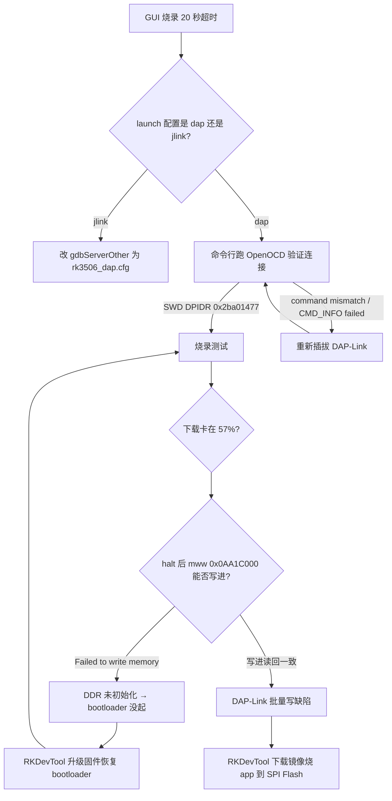

# RK3506 板端部署调试 Runbook

> 本文记录一次完整的 RK3506（RC-Pi-3506 睿擎派）板端部署调试过程，把「现象 → 定位 → 根因 →
> 修复」的排查路径固化成可复用的手册，供后续板端 bring-up / 换板 / 换调试器时对照排查。
>
> 适用范围：RK3506（3×Cortex-A7，无 NPU）+ DAP-Link（CMSIS-DAP）+ RuiChing Studio + OpenOCD。

---

## 1. 环境

| 项 | 值 |
|---|---|
| 板子 | RK3506（RC-Pi-3506 睿擎派，3×Cortex-A7@1.5GHz，无 NPU） |
| 调试器 | DAP-Link（CMSIS-DAP，SWD 接口，SWDIO / SWCLK / GND 三线） |
| IDE | RuiChing Studio v1.5.52 |
| OpenOCD | xpack-openocd-0.12.0-5（`Debugger_Support_Packages` 内） |
| 固件 | `RuiChing_RC-Pi-3506_Firmware_SMP_FACTORY_V1.4.0.img`（纯 RT-Thread，SMP 版） |
| 烧录工具 | RKDevTool v2.96（USB maskrom/loader 通道） |
| 工具链 | GNU Arm Embedded Toolchain 10.3-2021.10 |

---

## 2. 决策树总览



---

## 3. 分步排查

### 3.1 现象一：GUI 烧录 20 秒超时

**现象**：RuiChing Studio 点「调试/烧录」后，GDB 正常启动，但 20 秒后报
`[连接超时] 发送命令后 20 秒未收到响应`，`openocd.log` 里 OpenOCD 连 banner 都没打印。

**根因**：launch 配置里 `gdbServerOther` 指向 J-Link 配置（`rk3506_jlink.cfg`），
而实际硬件是 DAP-Link。OpenOCD 按 J-Link 协议找 Segger 仿真器，找不到就一直挂起。

**关键点**：RuiChing Studio 实际读取的 launch 配置**不是**工程里的 `.settings/*.rttlaunch`，
而是工作区里的：

```
.metadata/.plugins/org.eclipse.debug.core/.launches/<工程名>.OpenOCD.Debug.launch
```

**修复**：把该文件里的 `gdbServerOther` 改成：

```xml
<stringAttribute key="org.rtthread.studiopro.debug.rk3506.openocd.gdbServerOther"
    value="-f target/rk3506_dap.cfg"/>
```

> 改完务必**完全退出并重开 RuiChing Studio**（Eclipse 会把 launch 配置缓存进内存）。

### 3.2 命令行验证 OpenOCD（排除 GUI 干扰）

任何 GUI 问题，先用命令行单独跑 OpenOCD，确认物理层和配置正确：

```bash
openocd.exe -f target/rk3506_dap.cfg
```

看到以下输出即链路正常：

```
Info : SWD DPIDR 0x2ba01477              ← 识别到 RK3506
Info : [rk3506.ahb] Examination succeed
Info : [rk3506.0/1/2] Examination succeed  ← 3 核探测成功
Info : Listening on port 3333 for gdb connections
```

若出现 `CMSIS-DAP command mismatch` / `CMD_INFO failed` / `hid_write IO_PENDING`，
说明 **DAP-Link 的 USB/HID 层卡死**，需要**重新插拔 DAP-Link** 才能恢复。

### 3.3 现象二：下载卡在 57%（DDR 未初始化）

**判断 DDR 是否初始化**（telnet 连 4444 端口）：

```
targets rk3506.0
halt
mww 0x0AA1C000 0x12345678
mdw 0x0AA1C000 1
```

- 读回 `12345678` → DDR 正常；
- 报 `Failed to write memory` → **DDR 未初始化**（bootloader 没起来）。

**佐证**：`halt` 后读 `reg pc`：
- PC 停在 `0x0509xxxx`（Boot ROM）+ `MMU: disabled` → bootloader 卡在早期；
- PC 在 `0x050a/0x0511xxxx` + `MMU: enabled, D-Cache: enabled` → bootloader 已完整启动。

**根因**：断电重启后，Boot ROM 没能把 SPI Flash 里的 bootloader 拉起来（SPI Flash 里的
完整启动固件坏/丢）。之前能下载是因为板子一直通电、内存里残留着已加载好的 bootloader。

### 3.4 恢复 bootloader：RKDevTool 烧整包固件

DAP-Link **只能烧 app，烧不了 SPI Flash 的 bootloader**。必须走 USB 通道：

1. 装 USB 驱动（`DriverAssistant` → `DriverInstall.exe`）。
2. 板子 USB 接 OTG/下载口，**按住 loader 键 + 短按 reset 键**，进 loader 模式。
3. RKDevTool「升级固件」标签页，选 `RuiChing_RC-Pi-3506_Firmware_SMP_FACTORY_V1.4.0.img`，
   点「升级」，烧完自动重启。

烧完回到 3.3 验证 DDR 能写进了，即 bootloader 恢复。

### 3.5 现象三：下载仍卡 57%（DAP-Link 批量写缺陷）

DDR 已正常（单字 `mww` 能写进），但 GUI 下载 / `load_image` 批量写仍卡住。

**判断方法**：对比「单字写」与「批量写」：

- `mww` 单字写（含 57% 附近的地址）全部成功 → DDR 无坏区；
- `load_image <file> 0xAA1C000 bin` 批量写卡住 → 传输层问题。

**根因**：这颗 DAP-Link 的 **HID 大数据传输有缺陷**——小数据量（探测、单字写）正常，
连续传约 2.6MB 就中断（`command mismatch` / `hid_write IO_PENDING`）。

**无效的尝试**（已排除，勿重复）：
- 降 SWD 速度（10MHz→1MHz）：问题在 USB/HID 层，不在 SWD 层，无效；
- 换 USB 口 / 换线：无效。

### 3.6 最终方案：RKDevTool 烧 app 到 SPI Flash

既然 USB 通道传大数据正常（固件 7MB 都能烧），就**绕开 DAP-Link**，把 app 直接烧进
SPI Flash 的 app 分区，bootloader 开机时从 SPI Flash 加载运行。

1. 把最新 `app.img` 放进散件烧录包（`package-file` 已含 `app` 分区）。
2. RKDevTool「下载镜像」标签页，只烧 `app` 一行：
   - 地址 `0x1940000`（由 `parameter.txt` 的 `0x00008000@0x0000CA00(app)` 换算：`0xCA00 × 0x200`）
   - 文件选 `app.img`
3. 进 loader 模式，点「执行」。

---

## 4. 关键命令速查

```bash
# 命令行跑 OpenOCD（排除 GUI）
openocd.exe -f target/rk3506_dap.cfg

# telnet 连 OpenOCD 控制台（端口 4444）
telnet 127.0.0.1 4444
> targets rk3506.0      # 选 core 0
> halt                  # 停住 CPU（mww 前必须先 halt）
> reg pc                # 读 PC，判断 bootloader 状态
> mww 0x0AA1C000 0x12345678   # 写 DDR（验证是否初始化）
> mdw 0x0AA1C000 1            # 读回验证
> load_image C:/path/app_debug.img 0xAA1C000 bin   # 批量写（复现卡 57%）
> exit
```

---

## 5. 常见陷阱

1. **地址位数**：`0xACC0000`（181MB）和 `0xACC00000`（2897MB，超 DDR 范围）差了 10 倍。
   手写十六进制地址时极易多/少一个 0，会把「地址越界」误判成「DDR 坏区」。
2. **launch 配置位置**：改 `.settings/*.rttlaunch` 无效，要改工作区 `.metadata/.../launches/*.launch`，
   且改完要重启 IDE。
3. **jlink vs dap**：`rk3506_jlink.cfg` 与 `rk3506_dap.cfg` 仅 `adapter driver` 不同，但用错会一直超时。
4. **DAP-Link 卡死**：批量写中断后 DAP-Link 会进入 `command mismatch` 僵死态，只能重新插拔恢复。
5. **mww 前必须 halt**：`cortex_a` 的 `mww/mdw` 通过 CPU 执行，未 halt 会报 `not halted`。
6. **分区地址单位**：`parameter.txt` 的 mtdparts 用「块」（512B/块），RKDevTool 填的是字节地址，要 ×0x200。

---

## 6. 结论

| 现象 | 根因 | 修复 |
|---|---|---|
| GUI 烧录 20s 超时 | launch 配成 jlink | 改 `rk3506_dap.cfg` + 重启 IDE |
| 下载卡 57%（DDR 写不进） | bootloader 没起 | RKDevTool 烧整包固件 |
| 下载卡 57%（DDR 正常） | DAP-Link HID 批量写缺陷 | RKDevTool 烧 app 到 SPI Flash |

> 通用思路：GUI 问题先降到命令行 OpenOCD 验证；「单字写 vs 批量写」是区分
> 「地址/DDR 问题」和「传输层问题」的关键二分；DAP-Link 只能烧 app，bootloader 和
> 大文件下载优先走 USB（RKDevTool）通道。
